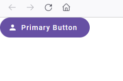

#JSUI

Version 0.0.1

## A javascript UI Library

The purpose of this library is:

- to provide a very easy to use JS UI library.
- to not depend on any preprocessor (like SAAS).
- to not need a virtual DOM.
- to not need XML within the code (like JSX).
- to support themes in CSS in a way that is very easy to read and modify.
- to avoid using the shadow DOM (that confuses developers).

## Coding Simplicity

One of the most important aspects of this library is **simplicity**.

Every object can be created by a function with the following signature:

```javascript
object(properties, ...children);
```

The **properties** parameter is an object that contains properties of the UI object.

The **children** parameter is a list of children objects, which can be created with the appropriate functions as well, in a similar fashion to html/xml.

For example, a button with the primary button look, an icon and text can be created like this:

```javascript
primaryButton({parent: document.body, enabled : true}, 
    icon({src: "/themes/material/icons/account.svg"}),
    "Primary Button")
```
The result is the following:



## CSS Simplicity

CSS is another language that the programmer has to face when dealing with web applications. This library intends to keep CSS to a minimum required to support themeing, while keeping the CSS as simple as possible.

CSS files will contain CSS selectors with classes only. Every UI object of the library will belong to some class, and will have a corresponding CSS entry.

For example, the primary button shown above has the following entries:

```css
.jsui-primary-button {
    display: flex;
    align-items: center;
    gap: 8px;
    font-family: var(--md-sys-typescale-label-large-font);
    line-height: var(--md-sys-typescale-label-large-line-height);
    font-size: var(--md-sys-typescale-label-large-size);
    letter-spacing: var(--md-sys-typescale-label-large-tracking);
    font-weight: var(--md-sys-typescale-label-large-weight);
    height: 40px;
    padding-left: 24px;
    padding-right: 24px;
    border-top-left-radius: 32px 32px;
    border-top-right-radius: 32px 32px;
    border-bottom-left-radius: 32px 32px;
    border-bottom-right-radius: 32px 32px;
}

.jsui-primary-button:enabled {
    background-color: var(--md-sys-color-primary);
    color: var(--md-sys-color-on-primary);
    border-width: 0;
}

.jsui-primary-button:disabled {
    background-color: var(--jsui-disabled-background-color);
    color: var(--jsui-disabled-text-color);
    border-width: 0;
}
```

The above style will be used for all UI objects, so discovering the styles and modifying them to suit your needs or your organization's UI preferences would be very easy.

## Styling

Styling components will also be very easy:

- a special property **style** can be used to define an object that contains styling properties.
- a special property **classes** can be used to define additional CSS class entries.

For example, if the primary button above needs to have a right padding of 32 pixels, it can be done in two ways:

First way: inline styles using the **style** property.

```javascript
primaryButton({parent: document.body, enabled : true, style: { paddingRight: "32px" }}, 
    icon({src: "/themes/material/icons/account.svg"}),
    "Primary Button")
```

Second way: CSS class and using the **classes** property.

```css
.big-padding-right {
    padding-right: 32px;
}
```
```javascript
primaryButton({parent: document.body, enabled : true, classes: "big-padding-right" }}, 
    icon({src: "/themes/material/icons/account.svg"}),
    "Primary Button")
```

